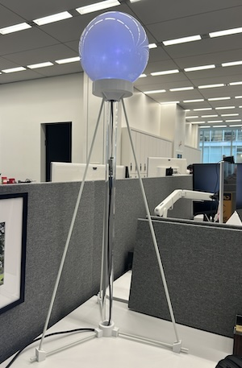

# weather-ball



A desktop lamp that tells you the weather.

Started during a "play day" with the New York Times Weather Team in June 2023. Completed in December 2025 :-) .

## Inspiration

Growing up in Minneapolis, I always made sure to spot the Weatherball — a glowing orb atop a bank that foretold the weather.

Reading this [Forgotten Minnesota article](https://forgottenminnesota.com/forgotten-minnesota/2012/03/170) took me back. It's exactly as I remember.

At a glance, you had a sense of what was coming:

> When the Weatherball is glowing red, warmer weather's just ahead. When the Weatherball is shining white, colder weather is in sight. When the Weatherball is wearing green, no weather changes are foreseen. Colors blinking by night and day say, precipitation's on the way.

(See the [ad on YouTube](https://youtu.be/0E5jcDt9tIM)!)

I've often thought of replicating the Weatherball for myself, and recently had an occaision to do so.

## Approach

### Colors and timing

According to [Forgotten Minnesota](https://forgottenminnesota.com/forgotten-minnesota/2012/03/170), "In its early days, the National Weather Service would call the bank each day at 4:14 p.m. to have a bank employee set the color of the Weatherball".

My initial plan was to mimic that, but later I decided to get fancy and use [WLED](https://kno.wled.ge/) to make a variety of colors and animations to reflect the forecast.

Additionally, after consulting with my Times weather colleagues who would be sitting next to the ball, I decided to reflect the forecast expected **in the next hour**. So looking at the ball at 10:35 a.m., for example, will give you the forecast for 11 a.m.

To pick the correct WLED preset for the forecast, I'm relying on the "[icon](https://www.weather.gov/forecast-icons)" value sent by the National Weather Service in their XML api. It dictates the icons used on [local weather pages](https://forecast.weather.gov/MapClick.php?lat=40.7130466&lon=-74.0072301).

To get the icon from the NWS and match the icon to the WLED preset, I'm using a Rapsberry Pi connected both to the internet and to a WLED controller.

## Building

### Hardware

- A Raspberry Pi connected to the internet and running nodejs
- A [string of multicolored, addressable LEDs](https://www.alibaba.com/product-detail/WS2811-WS2812-5V-3PIN-Black-Wire_1601449450195.html?spm=a2700.7724857.0.0.1fbb481apSm98r)
- A globe lamp top (from Ebay)
- 3D-printed stand (by me)
- A [WLED controller](https://www.adafruit.com/product/6332?srsltid=AfmBOoplxcLC_5V_fN_SjUxS82Fx95vbnGWywRqpA-yYg1ozKl7LOp0K), to animate the LEDs in weather-related patterns

### Rasberry Pi & ESP32 with WLED

After considering different setups, I setteled on pairing a Raspberry Pi with an ESP32 running WLED.

The **Raspberry Pi** would be responsible for:

- Running NodeJS
- Connecting to the internet
- Getting the weather
- Making a determinaiton about what preset to use
- Sending that preset to the ESP32 using the JSON API over a serial connection — quite possibly just the USB cable

The **ESP32** would be running [WLED](https://kno.wled.ge/), with animation presets I established and tested to work for various conditions including rain, wamer, colder, snow, storms, wind, sunny, temperate, super cold, etc.

### WLED controller

I'm using the very awesome [Adafruit Sparklemtion USB Stick](https://www.adafruit.com/product/6332?srsltid=AfmBOoofGwKl6_3wlmlOFxr0aYyvWj0LTiYwuOxKr_nXXjnp-QMIW6KU), which is set up for WLED. Was simple to install and connect to the LED strip.

After some experimentation, I set up a bunch of presets. I've stored the [WLED preset file](resources/wled_presets.json) and the [WLED configutation](resources/wled_cfg.json) in this repo.

### A wired connection

Making the serial connection from the Pi to the WLED controller could happen either over USB or the TX/RX pins. There's a great writeup of how to do that [here](https://data.engrie.be/ESP32/ESP32_-_Part_12_-_ESP32_meets_Raspberry_Pi.pdf).

In the end, I figured out how to make this connection over USB.

### Installing the PI operating system & serial capabilities

The full install instructions, including the Pi formatting, are [here](https://github.com/nebrius/raspi-io/wiki/Getting-a-Raspberry-Pi-ready-for-NodeBots). Seems like there may be some quirks that require a reformatting. Also handles adding Node, so that's good. Also I used version 24.x (instead of 12 in the docs).

I'd take this to the `node-serialport` point.

Node Serialport [installation notes](https://serialport.io/docs/guide-installation#raspberry-pi-linux) have additional info, and using Node Serialport is [here](https://serialport.io/docs/guide-usage). There's also info about parsers and things.

Serialport's [API docs](https://serialport.io/docs/api-serialport/) have example code to try.

### Controlling WLED over serial

[This comment](https://wled.discourse.group/t/serial-wired-api/3998/5) had the clearest info:

> It is working, WLED accepts the following ASCII string over RX pin “’{“on”:“t”,“v”:true}’” @ 115200 bits per second (I could not figure out how to change baudrate but that’s OK for me).

More on the serial connection is available in [the WLED docs](https://kno.wled.ge/interfaces/serial/). Including:

> If GPIO3 is allocated (e.g. for LED output), all Serial functionality except debug output is unavailable. If GPIO1 is allocated, all Serial output is disabled, including the JSON API response, Improv, and tpm2 output.

We're going to want the **JSON over Serial** part of these docs.

I determined that I should be able to [set new values](https://kno.wled.ge/interfaces/json-api/#setting-new-values) through the JSON API. The one we'll want, after the presets have been set, is `{"ps": x}`, where x is a preset number from -1 to 250.

First I tested controlling the WLED controller with my Mac.

- plugged WLED controller into Mac via USB
- listed available serial ports:

```
ls /dev/tty.*
```

One is ` /dev/tty.usbmodem5A7A0426761`

Using `screen`:

```
screen <port_name> <baud_rate>
```

so ...

```
screen /dev/tty.usbmodem5A7A0426761 115200
```

Pasting in `{"ps": 4}` or `{"ps": 2}` changes the preset! It worked. (Note that the text does not appear in the terminal, though)

#### Serial from Pi

Followed the instructions [here](https://serialport.io/docs/guide-usage)

```
To enable the serial port on Raspbian, you launch raspi-config, then select Interfacing Options, then Serial. You will then be asked two questions:

1. Would you like a login shell to be accessible over serial?
2. Would you like the serial port hardware to be enabled?

You must answer No to question 1 and Yes to question 2. If the login shell is left active, you will experience hangs and or disconnects.

If you're going to use sudo or root to install Node-Serialport, npm will require you to use the unsafe parameters flag.

sudo npm install serialport --unsafe-perm
```

Then I started using the example serialport code, but it required a path. I couldn't find any of the paths they described, and after some googling found that it might be called something like `/dev/ttyACM0` ... and sure enough, that was it.

From the pi, I was able to change the WLED presets by running the (testball.js)[testball.js] node script.

#### Logging into the Pi via SSH

Getting in, on the same network:

```
ssh weatherballpi@weatherballpi.local
```

Password saved in password manager.

```
cd ~/Code/weather-ball
```

#### Shutting down the pi

```
sudo shutdown -h now
```

## Data

The National Weather Service has a couple of APIs — one that's super easy to use and one that's more complicated. For a variety of reasons, I'm more interested in the more complicated one, and have started to play with it in [another project](https://github.com/jkeefe/bot-house/tree/main/bots/weather-box).

[Instructions for that API are here](https://digital.mdl.nws.noaa.gov/xml/).

So I think I might try that one, falling back to the easier one later if necessary.

[List of data fields available](https://digital.mdl.nws.noaa.gov/xml/docs/elementInputNames.php) (to include in the URL). Use like this: `&pop12=pop12`

_(NOTE: I tried to use the NWS forecast API at `https://api.weather.gov/gridpoints/OKX/33,37/forecast/hourly` but as with other projects I've played with, I couldn't get weather.gov to reliably provide fresh data, despite multiple attempts at clearing the cache. I'd often get results several hours old.)_

XML link example, using latitude/longitude of 40.7558, -73.9932:

https://digital.mdl.nws.noaa.gov/xml/sample_products/browser_interface/ndfdXMLclient.php?lat=40.77&lon=-73.98&product=time-series&maxt=maxt&mint=mint&temp=temp&appt=appt&pop12=pop12&wspd=wspd&wgust=wgust&icons=icons&qpf=qpf

For my use, I'm keying the ball off of what icons the NWS shows on their web page. Here's how to get just the icons:

https://digital.mdl.nws.noaa.gov/xml/sample_products/browser_interface/ndfdXMLclient.php?lat=40.77&lon=-73.98&product=time-series&icons=icons

## The code

The main script is [weather-ball.js](weather-ball.js).

### Cron

Running a Node.js Script Every 15 Minutes with Cron on Raspberry Pi (provided by ChatGPT). This configuration runs a Node.js script every 15 minutes, even when you are not logged in via SSH.

**Find Absolute Paths**

Cron does not load your shell environment, so absolute paths are required.

Find the Node binary:

`which node`

Example output:

`/usr/bin/node`

Find your script path, for example:

`/home/weatherballpi/Code/weather-ball/weather-ball.js`

**Make the Script Executable (Recommended)**

Add a shebang at the top of your script:

`#!/usr/bin/node`

Make it executable:

`chmod +x /home/weatherballpi/Code/weather-ball/weather-ball.js`

(Note: This alters the file, so you'll need to commit back to Github if you want to keep things in sync.)

Test manually:

`/home/weatherballpi/Code/weather-ball/weather-ball.js`

Also make a **tmp** directory for the log file.

`mkdir /home/weatherballpi/Code/weather-ball/tmp`

**Create the Cron Job**

Open your user crontab:

`crontab -e`

Add the following line:

```
*/15 * * * * /usr/bin/node /home/weatherballpi/Code/weather-ball/weather-ball.js >> /home/weatherballpi/Code/weather-ball/tmp/cron.log 2>&1
```

Or, for 5, 20, 35, 50 past the hour ...

```
5,20,35,50 * * * * /usr/bin/node /home/weatherballpi/Code/weather-ball/weather-ball.js >> /home/weatherballpi/Code/weather-ball/tmp/cron.log 2>&1
```

Cron Timing Fields

```
Field	Meaning

*/15	Every 15 minutes
*	Every hour
*	Every day of month
*	Every month
*	Every day of week
```

**Ensure Cron Is Running**

`sudo systemctl status cron`

Expected output:

`Active: active (running)`

**Verify Execution**

After 15 minutes:

`cat /home/weatherballpi/Code/weather-ball/tmp/cron.log`

To inspect cron activity:

`grep CRON /var/log/syslog`

**Environment Variables (If Needed)**

Cron does not load .bashrc or .profile. Define variables explicitly:

```
PATH=/usr/bin:/bin
NODE_ENV=production
*/15 * * * * /home/weatherballpi/Code/weather-ball/weather-ball.js >> /home/weatherballpi/Code/weather-ball/tmp/cron.log 2>&1
```

### Runding cron on boot

_from ChatGPT_

Provided your Raspberry Pi boots normally and the cron service is enabled, your cron job will resume automatically after every power cycle.

Here is what happens at startup:

- The operating system boots.
- The cron service starts as part of the system initialization sequence.
- Your user’s crontab is loaded into memory.
- The job begins executing again on the next matching schedule boundary.

There is nothing special you need to do in your crontab to make this happen.

One-Time Verification

Run the following command once to ensure cron is enabled at boot:

`sudo systemctl is-enabled cron`

Expected output:

`enabled`

If it is not enabled, correct it with:

`sudo systemctl enable cron`

From that point forward, your Raspberry Pi may be powered off, unplugged, or rebooted at any time, and your Node.js script will resume its 15-minute execution cycle automatically after startup.

## Other technologies I explored

### Circuit Playground & Pi

Originally I was going to use a Circuit Playground Board as the display board and a Raspberry Pi as the controller (the main reason: I need access to wifi and the internet to get the data).

BUT, the LEDs on board the Circuit Playground aren't great for lighting up my whole globe. Also it's a little bit of overkill: The CP boards have so many great sensors on them ... seems a waste to just use them for the LEDs.

### Arduino & Web Service

Also thought I could wire up an internet-connected Arduino that would hit a public JSON file I'd update with Github Actions. But I soon discovered that conneting Arduinos to the internet remains a hassle, and maintainingn a web service seemed like an extra step.

### Arduino & Raspberry Pi

Also looked into running a bunch of LEDs off an Arduino and control the Arduino via NodeJS with Johnny-Five & Node-pixel
on the Rasberry Pi, following [this great documentation as an example](https://chrisruppel.com/blog/arduino-johnny-five-neopixel/).

### ESP32C3 alone

I also considered using this ridiculously cheap [Seedstudio ESP32C3 board](https://www.seeedstudio.com/Seeed-XIAO-ESP32C3-p-5431.html).

It'd take a bit more work, and in the end not worth the hassle. But the code to make is happen is collected [on these pages](https://pinboard.in/search/u:jkeefe?query=ESP32C3).
